# 🔬 XAI Health Demo — Explainable AI & Digital Twin Simulation

> **A scientifically grounded, interactive web application demonstrating Explainable Artificial Intelligence (XAI) and Digital Twin concepts in the context of personal health risk analysis.**  
> Developed and presented by **Prof. Dr. Utku Köse** as a live seminar demonstration at **Süleyman Demirel University (SDU), Turkey** on **May 15, 2026**.

---

## 📌 Overview

XAI Health Demo is a full-stack web application built to bring together three cutting-edge research domains — **Explainable AI**, **Digital Twin technology**, and **preventive health modelling** — in a single, accessible, real-time interactive experience.

Participants fill out a structured health profile form, and the system immediately generates:
- A **personalized XAI risk report** with SHAP-like factor attribution
- A **living digital twin** — an animated SVG silhouette whose organs change color based on risk levels
- A **time evolution simulation** showing how the digital twin changes over 10 years under different lifestyle scenarios
- An **XAI causal network** visualizing how input factors flow through biological mechanisms to risk outcomes

The application was designed for seminar and conference settings, where an audience interacts in real time via QR code, and the presenter views the entire cohort's evolving digital twins on an admin dashboard.

---

## 🎯 Motivation & Scientific Significance

Despite remarkable advances in machine learning and deep learning, their clinical adoption in healthcare remains limited by a fundamental challenge: **the opacity of model decisions**. A model that predicts cardiovascular risk with 95% accuracy is of limited use to a clinician who cannot understand *why* a prediction was made.

This application directly addresses this challenge by:

1. **Making XAI tangible** — rather than presenting abstract SHAP values, each factor's contribution is shown as a bar with a causal explanation and mechanism chain (e.g., *Smoking → Endothelial damage → Inflammation → Atherosclerosis → CV Risk ↑*)

2. **Embodying the Digital Twin concept** — participants see a living representation of themselves that evolves in real time based on their health data, making abstract risk scores viscerally understandable

3. **Grounding every model decision in published science** — every risk factor, drift coefficient, and protective mechanism in the scoring engine is derived from peer-reviewed literature (see [Scientific References](#-scientific-references))

4. **Enabling counterfactual reasoning** — participants can change lifestyle factors and watch their digital twin respond instantly, demonstrating the XAI concept of *"what if I changed X?"*

---

## 📸 Screenshots

### Form — Data Entry (5 sections: Identity, Biometric, Lifestyle, Health History)
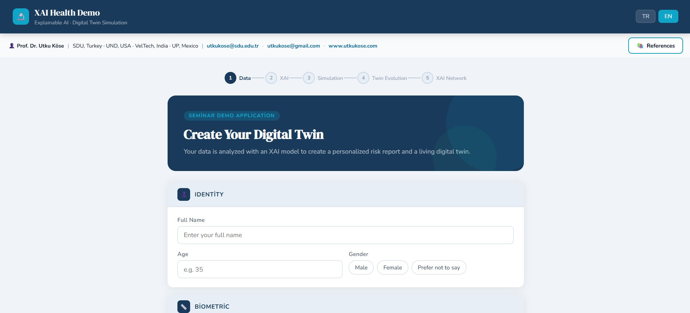

### XAI Risk Report — Score Cards + SHAP-like Factor Bars
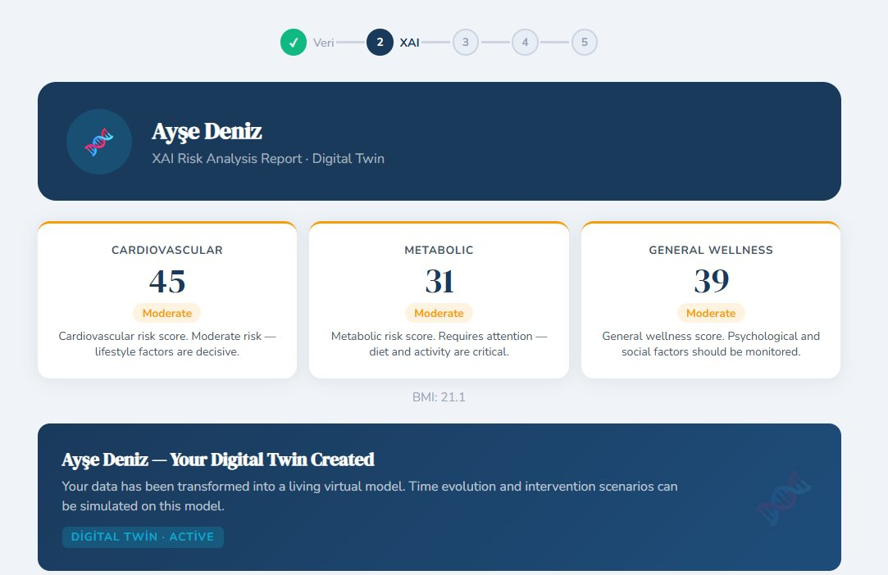
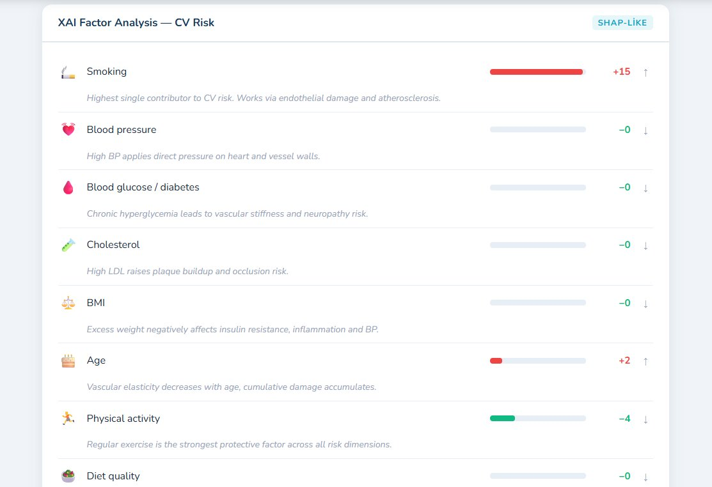
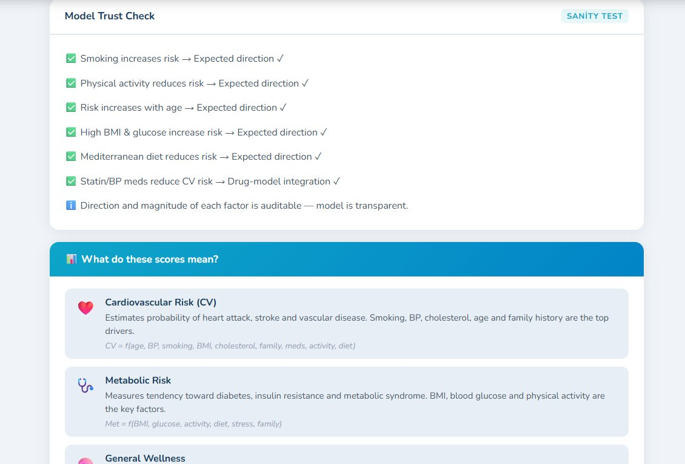

### Digital Twin — Time Evolution (Now → 10 Years)
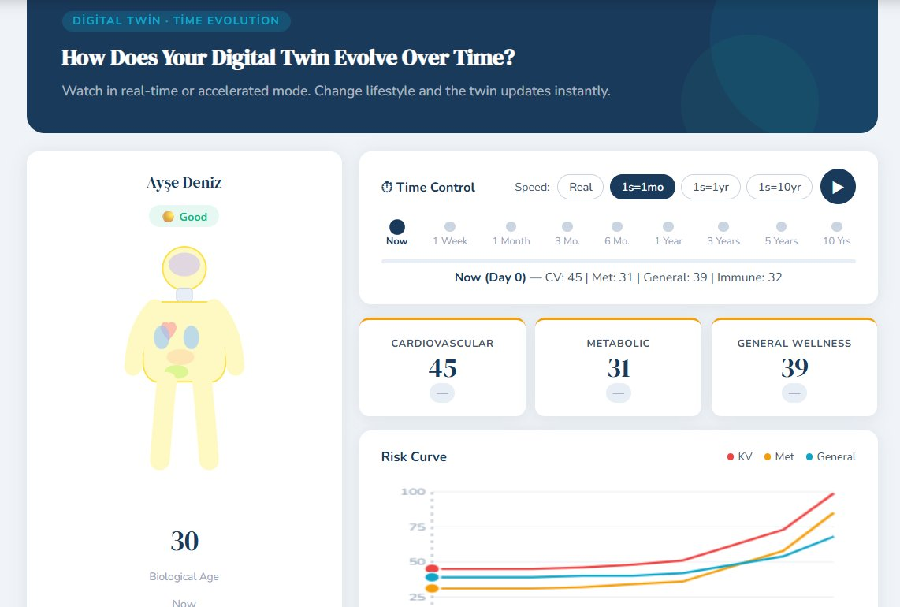
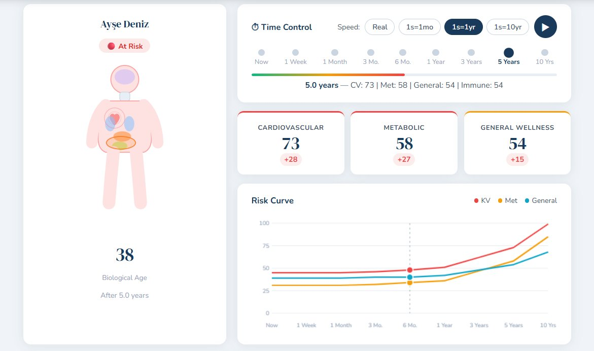

### Life Scenario + XAI Narrative
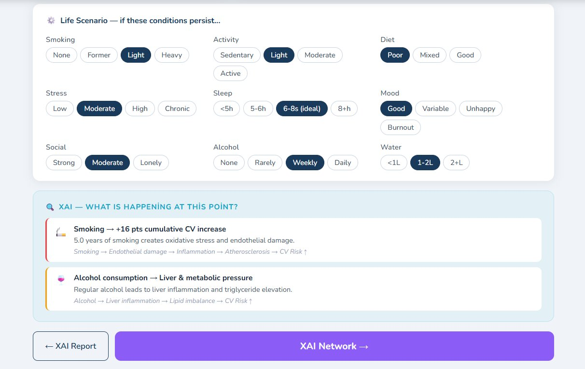

### XAI Causal Network (D3.js)
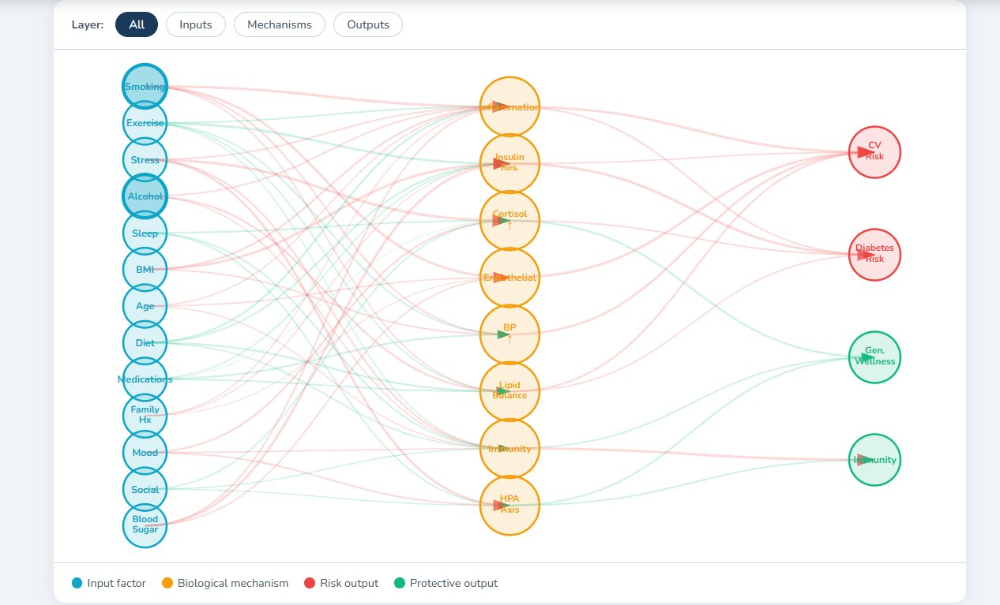
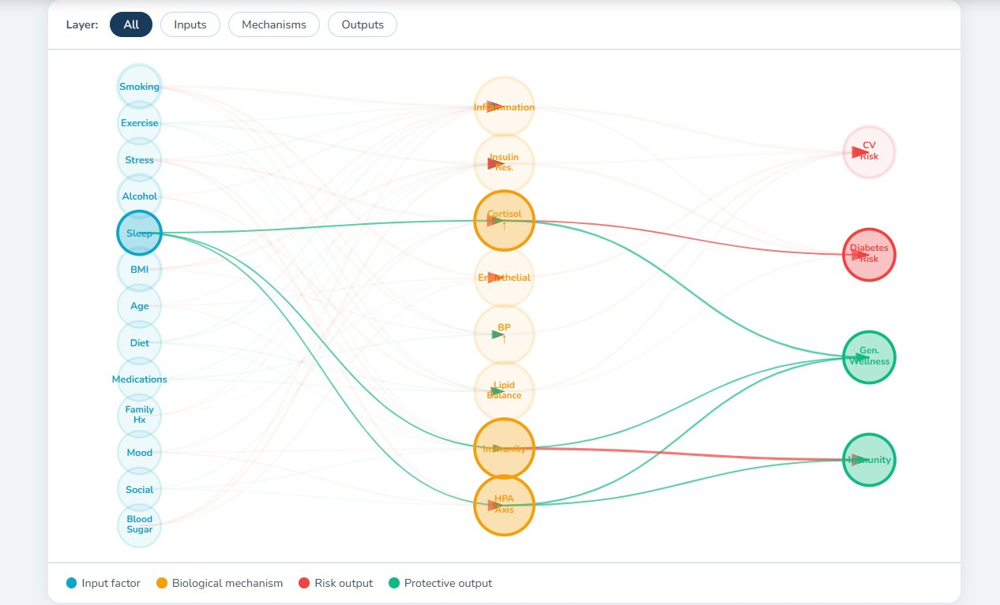

### Admin Dashboard — Cohort View + Live Digital Twins
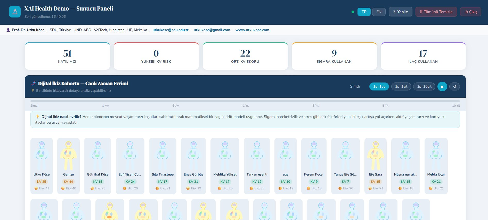
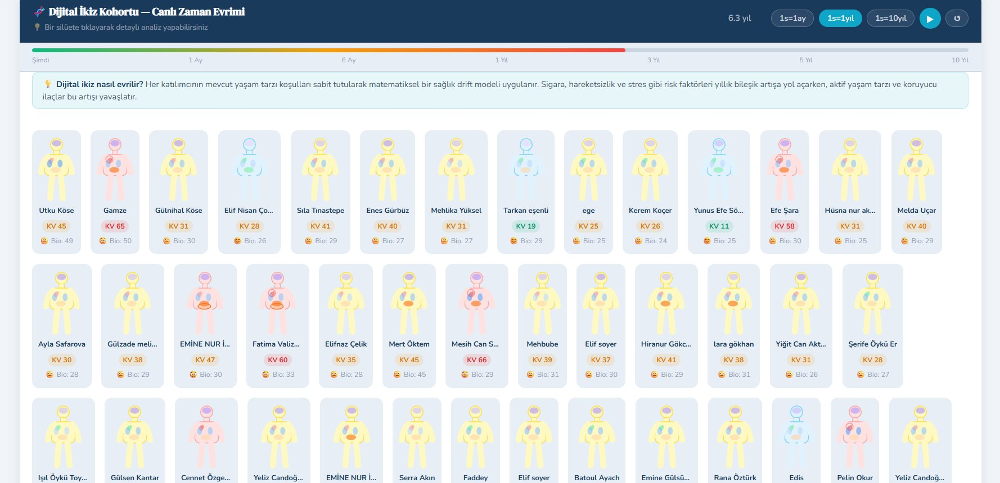
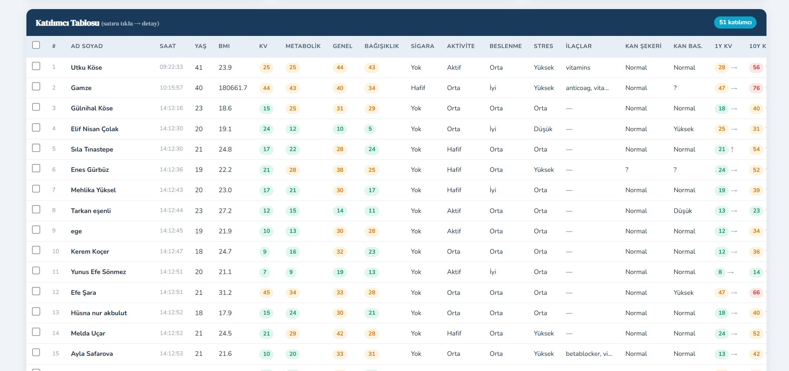

### Admin — Individual Modal (click any silhouette)
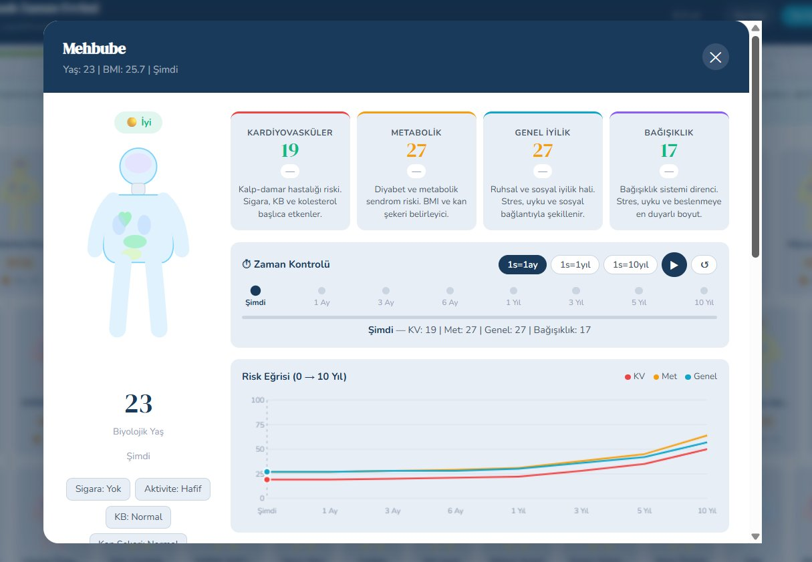
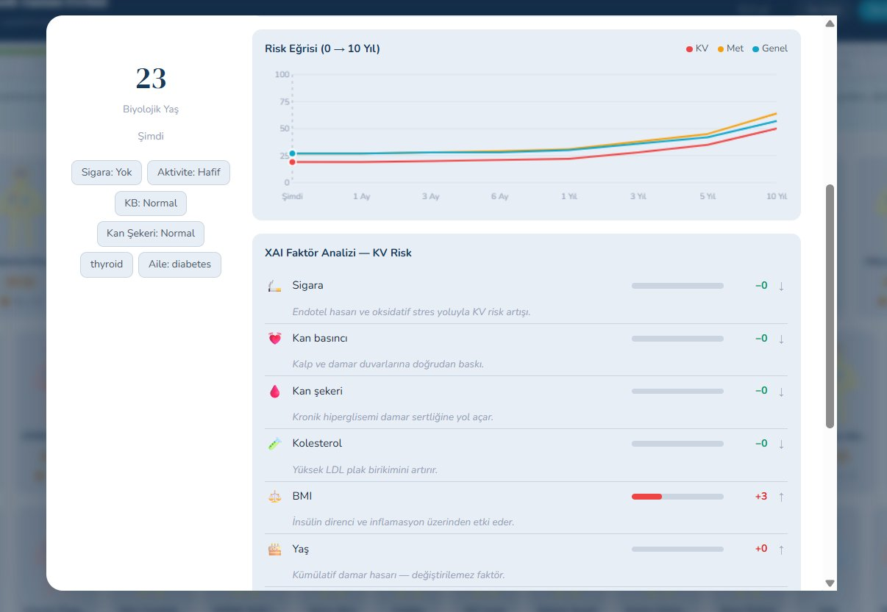

---

## ✨ Key Features

### Participant Interface (5 Pages)

| Page | Description |
|---|---|
| **1 · Data Entry** | Identity, biometrics (height, weight, BMI auto), blood pressure, cholesterol, blood sugar, 11 lifestyle parameters, 14 medication options, family history |
| **2 · XAI Report** | 3 risk score cards (CV, Metabolic, General Wellness) with causal explanations; SHAP-like factor bars with mechanism descriptions; Model Trust Check (sanity test); "What do these scores mean?" panel |
| **3 · Counterfactual** | Change 6 lifestyle factors in real time and watch the CV risk score update instantly — demonstrating XAI counterfactual reasoning |
| **4 · Digital Twin Evolution** | Animated SVG human silhouette with color-coded organs (heart → CV risk, liver → metabolic, brain → wellness, lungs → immunity); time modes: Real / 1s=1mo / 1s=1yr / 1s=10yr; 9 lifestyle scenario fields; risk curve canvas chart; XAI narrative with causal chains |
| **5 · XAI Network** | D3.js 3-layer causality network: 13 inputs → 8 biological mechanisms → 4 outputs; click any node to highlight its full causality path; user's high-risk inputs auto-highlighted |

### Admin Dashboard

| Feature | Description |
|---|---|
| **Live Cohort** | All participants' digital twins visible as mini silhouettes, all evolving simultaneously with Play/Pause time control |
| **Individual Modal** | Click any silhouette → full-size digital twin with time evolution, risk curves, XAI factor analysis |
| **Statistics** | Total participants, high CV risk count, average CV score, smokers, on medication |
| **Charts** | CV risk distribution, activity distribution, medication usage |
| **Table** | 18 columns including 1-year and 10-year CV projections with trend arrows |
| **Delete** | Per-row delete button + checkbox multi-select with bulk delete — all with confirmation dialog |
| **Auth** | JWT login with brute-force protection (5 attempts → 15 min lockout) |
| **Bilingual** | TR / EN toggle — all labels, explanations, status badges update instantly |

---

## 🏗️ Architecture

```
xai-health-demo/
├── main.py                  ← FastAPI backend
├── requirements.txt         ← fastapi, uvicorn, pydantic
├── .env                     ← Admin credentials (not committed)
├── static/
│   ├── index.html           ← Participant interface (1,800 lines, Vanilla JS + D3.js)
│   └── admin.html           ← Admin dashboard (1,100 lines)
└── data/
    └── participants.json    ← Auto-created on first run
```

**Backend:** FastAPI + Uvicorn + Pydantic v2  
**Frontend:** Vanilla HTML/CSS/JavaScript — zero build step, zero npm  
**Visualization:** D3.js v7 (CDN), Canvas API  
**Auth:** Pure stdlib JWT (HMAC-SHA256) + in-memory rate limiter  
**Data:** JSON file — no database dependency  
**Font:** Nunito + DM Serif Display (Google Fonts)

---

## ⚙️ Installation & Running

### Requirements

```bash
pip install -r requirements.txt
# fastapi>=0.110.0, uvicorn[standard]>=0.29.0, pydantic>=2.0.0
```

### Configure Admin Credentials

```bash
cp .env.example .env   # or create .env manually
nano .env
```

```env
ADMIN_USERNAME=admin
ADMIN_PASSWORD=YourStrongPasswordHere!
JWT_SECRET=generate-with-python3-c-import-secrets-print-secrets-token-hex-32
TOKEN_EXPIRE_H=8
MAX_ATTEMPTS=5
LOCKOUT_MIN=15
```

Generate a secure JWT secret:
```bash
python3 -c "import secrets; print(secrets.token_hex(32))"
```

### Run

```bash
# Development
uvicorn main:app --host 127.0.0.1 --port 8080 --reload

# Production / seminar
uvicorn main:app --host 0.0.0.0 --port 8080

# Background (server)
nohup uvicorn main:app --host 0.0.0.0 --port 8080 > server.log 2>&1 &
```

### Access

| URL | Description |
|---|---|
| `http://localhost:8080` | Participant form |
| `http://localhost:8080/admin` | Admin dashboard (login required) |

### QR Code for Seminar

```bash
pip install qrcode pillow
python3 -c "import qrcode; qrcode.make('http://YOUR_IP:8080/').save('qr.png')"
```

---

## 🔒 Security

- **JWT authentication** on all admin endpoints (stdlib only, zero extra dependencies)
- **Brute-force protection**: configurable attempt limit + lockout duration per IP
- **Constant-time password comparison** (prevents timing attacks)
- **Participant form** is public (by design — participants don't need accounts)
- **Credentials** live in `.env`, never in source code

---

## 🧮 Risk Scoring Model

The scoring engine computes four independent risk dimensions:

| Dimension | Key Drivers |
|---|---|
| **Cardiovascular (CV)** | Smoking, blood pressure, cholesterol, age, BMI, family history, medications, physical inactivity |
| **Metabolic** | BMI, blood glucose/diabetes status, physical activity, diet quality, stress, family history |
| **General Wellness** | Stress level, mood, social connection, sleep, physical activity, alcohol, sitting time |
| **Immunity** | Stress, mood, sleep quality, smoking, diet, water intake, social connection, age |

**Medication integration:** statins (−18% CV), ACE inhibitors (−15% CV), metformin (−20% metabolic), chronic NSAIDs (+8% CV), vitamins (−8% wellness), etc.

**Time drift model:** Annual compounding increase per dimension, with logistic clamping (max 99). Each lifestyle scenario field modulates the drift rate in real time.

All scoring weights are grounded in the peer-reviewed literature listed below.

---

## 📚 Scientific References

### XAI Methods
- Lundberg, S. M. & Lee, S.-I. (2017). A unified approach to interpreting model predictions. *Advances in Neural Information Processing Systems, 30*, 4765–4774. — **[SHAP — basis for factor attribution bars]**
- Ribeiro, M. T., Singh, S. & Guestrin, C. (2016). "Why Should I Trust You?": Explaining the predictions of any classifier. *Proceedings of the 22nd ACM SIGKDD*, 1135–1144. https://doi.org/10.1145/2939672.2939778 — **[LIME — basis for counterfactual simulation]**
- Bharati, S., Mondal, M. R. H. & Podder, P. (2023). A review on explainable artificial intelligence for healthcare: Why, how, and when? *IEEE Access*. https://doi.org/10.48550/arXiv.2304.04780

### Digital Twin & Health Simulation
- Thangaraj, P. M., Benson, S. H., Oikonomou, E. K., Asselbergs, F. W. & Khera, R. (2024). Cardiovascular care with digital twin technology in the era of generative artificial intelligence. *European Heart Journal, 45*(45), 4808–4821. https://doi.org/10.1093/eurheartj/ehae619
- Sel, K., et al. (2024). Building digital twins for cardiovascular health: From principles to clinical impact. *Journal of the American Heart Association, 13*(19), e031981. https://doi.org/10.1161/JAHA.123.031981

### Cardiovascular Risk Foundations
- Estruch, R., Ros, E., Salas-Salvadó, J., et al. (2018). Primary prevention of cardiovascular disease with a Mediterranean diet. *New England Journal of Medicine, 378*(25), e34. https://doi.org/10.1056/NEJMoa1800389 — **[Diet quality factor]**
- Messner, B. & Bernhard, D. (2014). Smoking and cardiovascular disease: Mechanisms of endothelial dysfunction and early atherogenesis. *Arteriosclerosis, Thrombosis, and Vascular Biology, 34*(3), 509–515. https://doi.org/10.1161/ATVBAHA.113.300156 — **[Smoking factor mechanism]**
- Masmoum, M. D., et al. (2024). The effectiveness of exercise in reducing cardiovascular risk factors among adults. *Cureus, 16*(9), e68928. https://doi.org/10.7759/cureus.68928 — **[Physical activity factor]**

### Stress, Cortisol & Social Health
- Steptoe, A. & Kivimäki, M. (2013). Stress and cardiovascular disease: An update on current knowledge. *Annual Review of Public Health, 34*, 337–354. https://doi.org/10.1146/annurev-publhealth-031912-114452 — **[Stress / HPA axis factor]**
- Holt-Lunstad, J., Smith, T. B., Baker, M., Harris, T. & Stephenson, D. (2015). Loneliness and social isolation as risk factors for mortality. *Perspectives on Psychological Science, 10*(2), 227–237. https://doi.org/10.1177/1745691614568352 — **[Social connection factor]**

---

## ⚠️ Disclaimer

Risk scores generated by this application are **not medical diagnostic tools**. They are intended exclusively for **educational and demonstration purposes** to illustrate XAI and digital twin concepts. For clinical decisions, always consult a qualified healthcare professional.

---

## 📄 License

This project is licensed under the **MIT License**.

```
MIT License

Copyright (c) 2026 Utku Köse

Permission is hereby granted, free of charge, to any person obtaining a copy
of this software and associated documentation files (the "Software"), to deal
in the Software without restriction, including without limitation the rights
to use, copy, modify, merge, publish, distribute, sublicense, and/or sell
copies of the Software, and to permit persons to whom the Software is
furnished to do so, subject to the following conditions:

The above copyright notice and this permission notice shall be included in all
copies or substantial portions of the Software.

THE SOFTWARE IS PROVIDED "AS IS", WITHOUT WARRANTY OF ANY KIND, EXPRESS OR
IMPLIED, INCLUDING BUT NOT LIMITED TO THE WARRANTIES OF MERCHANTABILITY,
FITNESS FOR A PARTICULAR PURPOSE AND NONINFRINGEMENT. IN NO EVENT SHALL THE
AUTHORS OR COPYRIGHT HOLDERS BE LIABLE FOR ANY CLAIM, DAMAGES OR OTHER
LIABILITY, WHETHER IN AN ACTION OF CONTRACT, TORT OR OTHERWISE, ARISING FROM,
OUT OF OR IN CONNECTION WITH THE SOFTWARE OR THE USE OR OTHER DEALINGS IN THE
SOFTWARE.
```

---

<div align="center">

**Prof. Dr. Utku Köse**  
Süleyman Demirel University · University of North Dakota · VelTech University · Universidad Panamericana  
[utkukose@sdu.edu.tr](mailto:utkukose@sdu.edu.tr) · [www.utkukose.com](https://www.utkukose.com)

</div>
